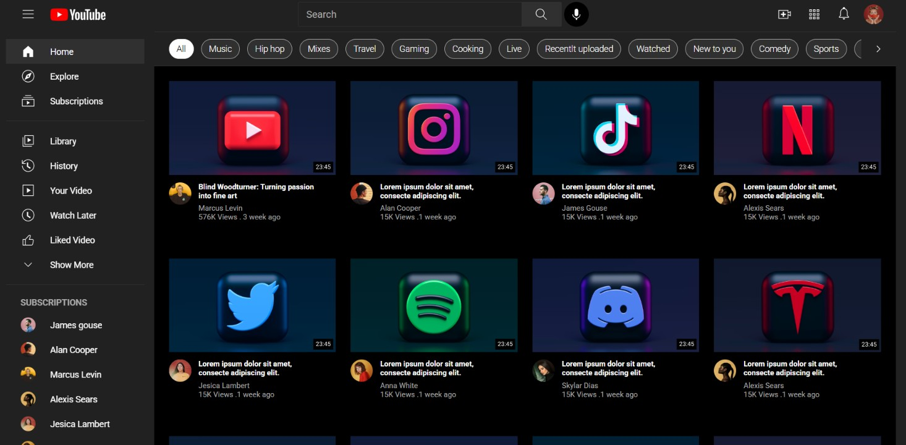
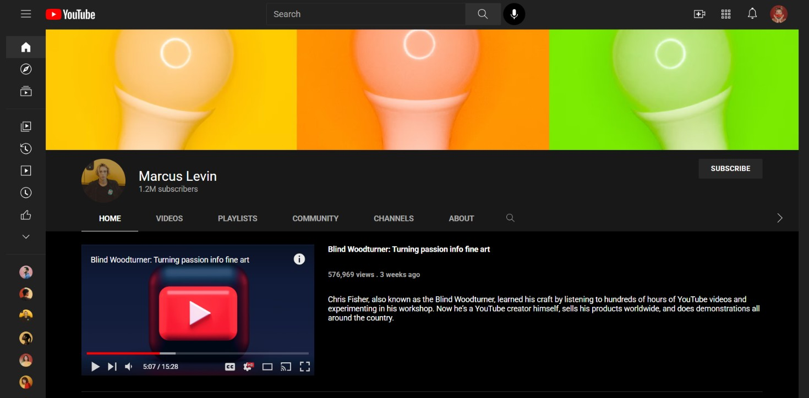
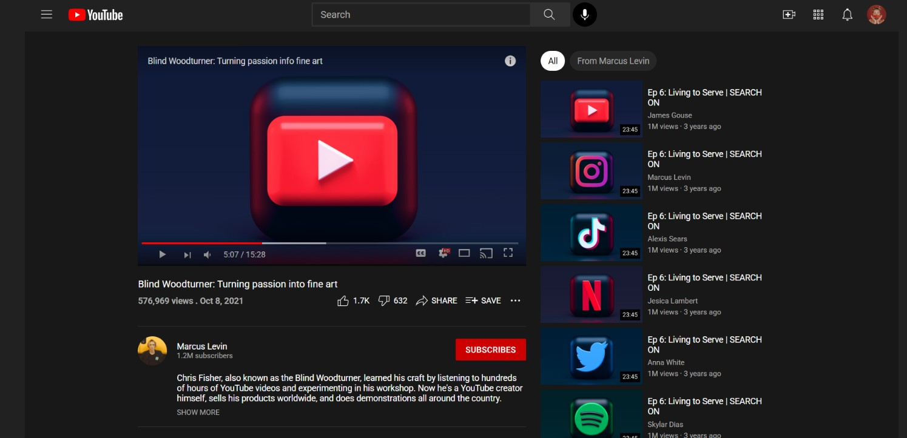

# Oreumi Frontend 15기
## First Team Project (OH.js팀)

# YouTube Clone (HTML/CSS Only)
 
JavaScript 없이 **순수 HTML + CSS**만으로 유튜브의 주요 페이지 3개(홈 / 채널 / 동영상 시청)를 구현한 프로젝트입니다.
탭 전환, 사이드바 접기/펼치기, 드롭다운 메뉴, 구독 상태 관리, 모달까지 전부 `<input type="checkbox|radio">`와 CSS `:checked`, `:has()` 선택자만으로 동작합니다.


## 프로젝트 팀 구성 및 역할
 
| 이름 | 역할 | 담당 업무 |
|---|---|---|
| 오수빈 | 팀장, 서기 총괄 | HOME 페이지 제작(HTML/CSS), 공통 헤더·사이드바 제작(HTML/CSS), CHANNEL 페이지 HTML 제작, CHANNEL 페이지 CSS 디테일 추가, 발표자료 제작 |
| 황길용 | 팀원, Git 관리 총괄 | VIDEO 페이지 제작(HTML/CSS), CHANNEL 페이지 기본 CSS 제작, 발표 |


## 프로젝트 팀 구성 및 역할
 
| 이름 | 역할 | 담당 업무 |
|---|---|---|
| 오수빈 | 팀장, 서기 총괄 | HOME 페이지 제작(HTML/CSS), 공통 헤더·사이드바 제작(HTML/CSS), CHANNEL 페이지 HTML 제작, CHANNEL 페이지 CSS 디테일 추가, 발표자료 제작 |
| 황길용 | 팀원, Git 관리 총괄 | VIDEO 페이지 제작(HTML/CSS), CHANNEL 페이지 기본 CSS 제작, 발표 |


## 데모
 
| 페이지 | 파일 | 설명 |
|---|---|---|
| 🏠 Home | `index.html` | 영상 그리드, 카테고리 필터 탭 |
| 📺 Channel | `channel.html` | 채널 배너, 탭(HOME/VIDEOS/...), 플레이리스트, 구독 버튼 |
| ▶️ Video | `video.html` | 영상 플레이어, 좋아요/싫어요, 댓글, 관련 영상 |
 




-->
 
## 기술 스택
 
- **HTML5**, **CSS3** (프레임워크·라이브러리·JavaScript 없음)
- 사용한 CSS 기능
  - `Flexbox` / `Grid` 레이아웃
  - `:has()` 선택자 — 부모/조상 요소의 상태에 따라 자식 스타일 제어
  - `:checked` 선택자 (checkbox·radio hack) — 클릭 인터랙션 구현
  - Container Queries (`container-type`, `cqw`) — 부모 요소 크기에 비례한 폰트 크기
  - `clamp()`, `aspect-ratio` — 유동적인 반응형 사이징
  - CSS 커스텀 프로퍼티(`:root` 변수)로 색상·간격 값 공통 관리
## 폴더 구조
 
```
├── index.html               # 홈 페이지
├── channel.html             # 채널 페이지
├── video.html               # 동영상 시청 페이지
│
├── youtube-style.css        # 공통 헤더 + 사이드바 (홈, 채널에서 사용)
├── side-video.css           # 동영상 페이지 전용 헤더 + 사이드바 (오버레이형)
├── home-style.css           # 홈 페이지 전용 스타일
├── channel-style.css        # 채널 페이지 전용 스타일
├── video-style.css          # 동영상 페이지 전용 스타일
│
└── img/                      # 아이콘 · 썸네일 · 프로필 이미지
```
 
> 홈/채널 페이지는 `youtube-style.css`(사이드바가 콘텐츠를 옆으로 밀어내는 방식)를 공유하고,
> 동영상 페이지는 `side-video.css`(사이드바가 콘텐츠 위에 겹쳐지는 오버레이 방식)를 따로 씁니다.
> 영상 재생 화면처럼 레이아웃이 밀리면 안 되는 페이지라서 사이드바 동작 방식을 분리했습니다.
 
## 주요 기능 & 구현 방법
 
### 공통
 
- **사이드바 접기/펼치기**
  햄버거 버튼을 숨겨진 체크박스(`#hamburger-toggle`)와 연결하고, `body:has(.hamburger-input:checked) .sidebar { width: 72px; }` 형태로 체크 여부에 따라 사이드바 너비와 메뉴 텍스트 노출 여부를 전환했습니다.
- **프로필 드롭다운 메뉴**
  동일한 체크박스 hack(`.profile-input:checked ~ .profile-drop`)으로 클릭 시 메뉴가 열리고 닫히도록 구현했습니다.
- **반응형 레이아웃**
  Desktop(1024px~) / Tablet(~1024px) / Mobile(~767px) 3단계 미디어쿼리로 나눠서, 화면이 줄어들수록 패딩·폰트·레이아웃이 자연스럽게 축소되도록 `clamp()`와 유동 단위를 적극 사용했습니다.
### 🏠 Home
 
- `display: grid`로 영상 그리드를 구성했고, 화면 크기에 따라 4열 → 2열 → 1열로 컬럼 수를 바꿨습니다.
- 카테고리 필터 탭은 `overflow-x: auto`로 가로 스크롤 가능하게 처리했습니다.
### 📺 Channel
 
- **탭 전환(HOME/VIDEOS/PLAYLISTS/COMMUNITY/CHANNELS/ABOUT)**
  라디오 버튼(`name="channel-tab"`)과 `:checked` 선택자로 탭마다 다른 콘텐츠 영역을 보여주고 숨겼습니다.
- **플레이리스트 반응형 개수 노출**
  `display: grid`로 영상을 나열하고, 화면 크기별로 `grid-template-columns`와 `nth-child(n+N) { display:none }` 조합을 사용해 데스크탑 5개 → 태블릿 3개 → 모바일 2개까지만 보이게 했습니다.
- **더보기(›) 버튼 위치**
  숨겨진 영상은 `display:none`으로 완전히 레이아웃에서 빠지기 때문에, 더보기 버튼을 `position:absolute; right:0`으로 배치하면 화면 크기와 상관없이 항상 마지막으로 보이는 영상의 오른쪽 끝에 자동으로 붙습니다.
- **구독 버튼 + 구독 취소 확인 모달**
  보이지 않는 체크박스 2개(`#subs-toggle`: 구독 여부, `#unsub-toggle`: 모달 오픈 여부)로 상태를 저장하고, `body:has(#subs-toggle:checked):has(#unsub-toggle:checked) .modal-overlay { display:flex; }` 조건으로 모달을 띄웠습니다. "구독 취소" 버튼은 `#subs-toggle`만 해제하는데, 그 순간 모달을 띄우는 조건도 함께 깨지기 때문에 모달이 자동으로 닫힙니다.
- **이미지 비율 유지**
  썸네일이 잘리지 않도록 `object-fit: contain`을 사용하고, 레터박스 여백은 배경색으로 자연스럽게 채웠습니다.
- **컨테이너 쿼리로 글자 크기 비례 조정**
  `container-type: inline-size`를 준 요소 안에서 `cqw` 단위를 사용해, 사이드바 접힘/펼침으로 콘텐츠 폭이 달라져도 제목·설명 글자 크기가 그 폭에 비례해서 커지고 작아지도록 했습니다.
### ▶️ Video
 
- 좋아요/싫어요, 저장, 공유 등 상세 액션 버튼 UI를 구현했습니다.
- **채널 정보 영역에 구독 버튼 + 구독 취소 확인 모달 추가**
  Channel 페이지에서 쓴 것과 동일한 체크박스 2개(`#subs-toggle`, `#unsub-toggle`) 조합 패턴을 그대로 재사용해서, 영상 아래 채널 정보(`channel-info`) 영역에서도 JS 없이 구독 → 구독중 전환과 구독 취소 확인 모달이 동작하도록 구현했습니다.
- **댓글 정렬 드롭다운 (인기순 / 최신순)**
  체크박스(`#sort-toggle`) 하나로 드롭다운 메뉴(`.sort-menu`)를 열고 닫습니다. 화면 전체를 덮는 투명한 `<label for="sort-toggle" class="sort-overlay">`를 깔아둬서, 메뉴 바깥 아무 곳이나 클릭해도 같은 체크박스가 해제되며 드롭다운이 닫히도록 했습니다.
- 댓글 목록 영역(작성자, 본문, 답글)을 구성했습니다.
- 관련 영상 목록의 필터 칩(전체/이 채널의 다른 동영상)은 라디오 버튼 hack으로 전환됩니다. 관련 영상 카드도 `video-card__thumbnail`, `video-card__title`처럼 BEM 방식으로 구조를 정리했습니다.
- 사이드바가 오버레이 형태로 동작해 영상 재생 레이아웃이 밀리지 않도록 했습니다. 사이드바가 열려있는 동안에는 `body:has(.hamburger-input:checked) { overflow-y: hidden; }`으로 뒤 배경 스크롤을 막았습니다.
  
## 반응형 브레이크포인트
 
| 구간 | 기준 |
|---|---|
| Desktop | 1024px 초과 |
| Tablet | 768px ~ 1024px |
| Mobile | 767px 이하 |
 
## 트러블슈팅
 
- **CSS 우선순위(specificity) 충돌**: 같은 요소를 가리키는 두 규칙(`.player-controls button img`와 `.play-btn img`)이 있을 때, 클래스 수는 같아도 태그 선택자 개수가 많은 쪽이 이겨서 의도한 스타일이 반영되지 않는 문제가 있었습니다. → 원인이 되는 상위 규칙보다 명시도가 높은 선택자로 재정의해 해결했습니다.
- **`position: fixed` 정렬 문제**: 모달을 깊은 곳에 중첩해두면 조상 요소의 스타일에 따라 뷰포트 기준 정렬이 깨질 수 있어, 모달을 `body` 최상위로 옮겨 항상 화면 중앙에 고정되도록 했습니다.
- **`display: flex`와 `justify-content` 누락**: 텍스트를 감싼 `flex` 컨테이너에 `justify-content`를 지정하지 않으면 `text-align: center`가 무시되고 왼쪽 정렬되는 점을 발견해 명시적으로 지정했습니다.
## 실행 방법
 
1. 저장소를 클론합니다.
```bash
   git clone <repository-url>
```
2. `index.html`, `channel.html`, `video.html` 중 원하는 파일을 브라우저로 열거나, VSCode의 Live Server 확장으로 실행합니다.
3. 별도의 빌드 과정이나 패키지 설치가 필요 없습니다.
## 브라우저 지원
 
`:has()` 선택자와 CSS Container Query를 사용하므로 **최신 Chrome / Edge / Safari / Firefox** (2023년 이후 버전)에서 정상적으로 동작합니다.
